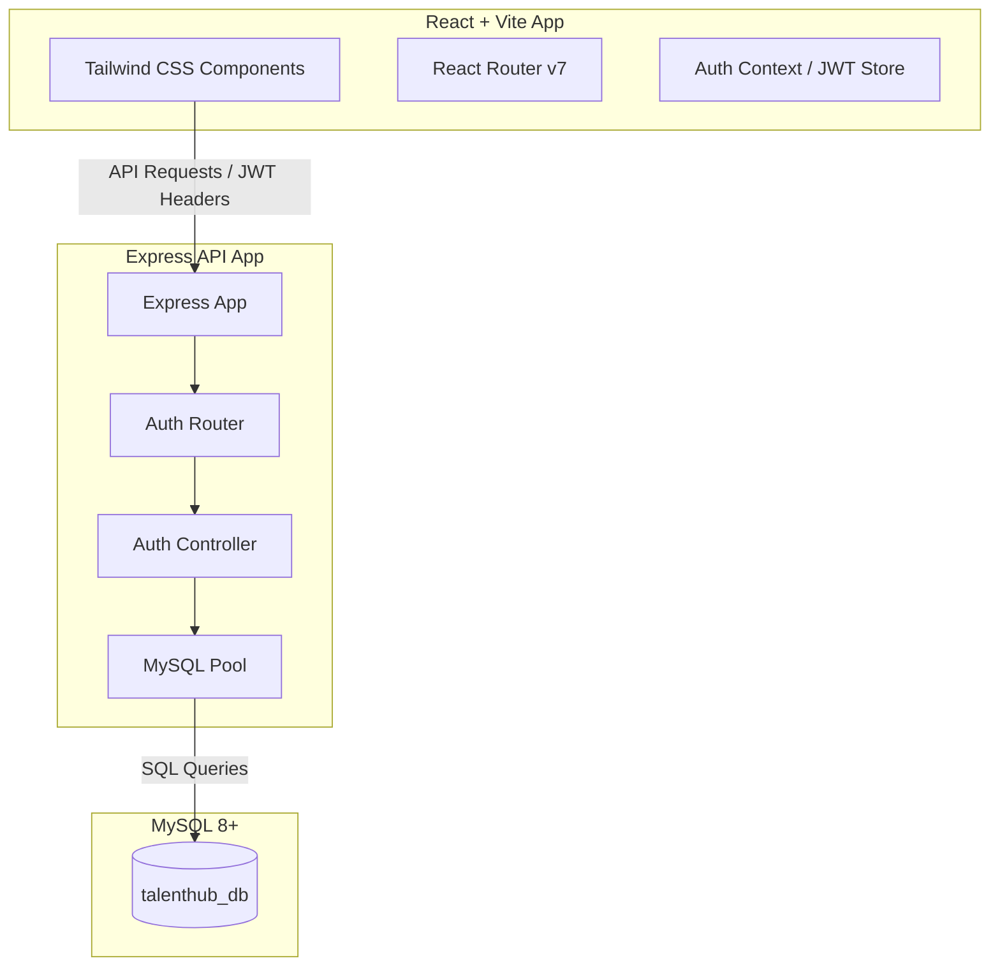
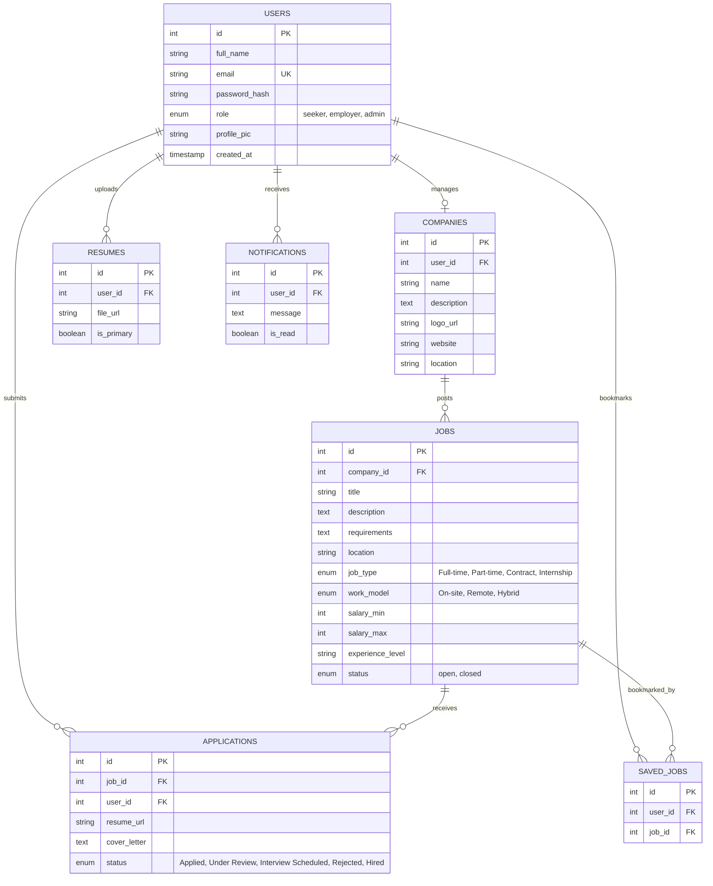
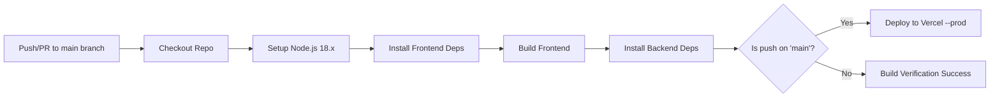

# TalentHub Job Board - Project Documentation

TalentHub is a full-stack Job Board application built with a modern React + Vite frontend, a Node.js + Express backend, and a MySQL relational database. The project is designed with a separate frontend-backend architecture ready for serverless deployment on Vercel and CI/CD integration with GitHub Actions.

---

## Table of Contents
1. [System Architecture](#1-system-architecture)
2. [Database Schema Design](#2-database-schema-design)
3. [API Endpoints Reference](#3-api-endpoints-reference)
4. [Local Development Setup](#4-local-development-setup)
5. [Build and Test Pipeline](#5-build-and-test-pipeline)
6. [Deployment Configuration (Vercel & CI/CD)](#6-deployment-configuration-vercel--cicd)

---

## 1. System Architecture



### Technology Stack
*   **Frontend**: 
    *   **React 19**: Responsive, fast, hook-based application.
    *   **Vite**: Next-generation frontend tooling for ultra-fast hot module replacement.
    *   **React Router v7**: Declarative client-side routing.
    *   **Tailwind CSS**: Utility-first CSS styling framework.
    *   **Axios**: Promise-based HTTP client for API communication.
*   **Backend**:
    *   **Express 5**: Fast, minimal web framework for routing.
    *   **MySQL2**: Promise-based MySQL client for Node.js.
    *   **JSON Web Tokens (JWT)**: Secure, stateless token-based authorization.
    *   **Bcrypt**: Salted password hashing algorithm for security.
    *   **Helmet & Express Rate Limit**: Protection against common web vulnerabilities and rate-limiting brute force attacks.
*   **Database**:
    *   **MySQL 8**: Robust relational database for transactional queries and indexing.

---

## 2. Database Schema Design

The database schema is defined in [schema.sql](file:///d:/talentHUB/backend/database/schema.sql). It is optimized with indexes on common lookup fields (e.g., user email, job titles, and locations).



### Table Details
1.  **`users`**: Contains auth credentials (hashed passwords) and user roles.
2.  **`companies`**: Linked to a user with role `employer`. Holds company details.
3.  **`jobs`**: Job postings including salary range, requirements, work model, and type.
4.  **`applications`**: Links job seekers to jobs, tracking the interview state.
5.  **`saved_jobs`**: Bookmark system enabling users to keep track of jobs.
6.  **`resumes`**: Paths/URLs to uploaded PDF resumes.
7.  **`notifications`**: Simple real-time system alerts for interview status changes, updates, etc.

---

## 3. API Endpoints Reference

The backend exposes RESTful endpoints (prefixed by `/api`). 

### Health Check
*   **`GET /api/health`**
    *   **Description**: Verifies if the backend server and its DB connection pool are active.
    *   **Response (200 OK)**:
        ```json
        {
          "status": "ok",
          "message": "API is running smoothly"
        }
        ```

### Authentication
*   **`POST /api/auth/register`**
    *   **Description**: Registers a new seeker or employer.
    *   **Request Body**:
        ```json
        {
          "fullName": "Alice Smith",
          "email": "alice@example.com",
          "password": "Password123!",
          "role": "seeker"
        }
        ```
    *   **Response (201 Created)**:
        ```json
        {
          "message": "User registered successfully!",
          "userId": 12
        }
        ```

*   **`POST /api/auth/login`**
    *   **Description**: Authenticates users and issues a stateless JSON Web Token (JWT).
    *   **Request Body**:
        ```json
        {
          "email": "alice@example.com",
          "password": "Password123!"
        }
        ```
    *   **Response (200 OK)**:
        ```json
        {
          "message": "Login successful",
          "token": "eyJhbGciOi...",
          "user": {
            "id": 12,
            "fullName": "Alice Smith",
            "email": "alice@example.com",
            "role": "seeker"
          }
        }
        ```

---

## 4. Local Development Setup

### Step 1: Database Setup
1.  Create a MySQL database named `talenthub_db`:
    ```sql
    CREATE DATABASE talenthub_db;
    ```
2.  Import schema tables and seed data using the helper scripts in `backend`:
    ```bash
    cd backend
    node setup-db.js    # Runs database/schema.sql
    node seed-users.js   # Seeds dummy seekers and employers
    ```

### Step 2: Configure Environment Variables
Create a `.env` file in the `/backend` folder based on `.env.example`:
```env
PORT=5000
DB_HOST=localhost
DB_USER=root
DB_PASSWORD=YourDatabasePassword
DB_NAME=talenthub_db
JWT_SECRET=supersecretjwtkey_change_in_production
JWT_EXPIRES_IN=1d
```

### Step 3: Run the Applications

#### Backend
1. Navigate to `/backend`.
2. Install dependencies: `npm install`
3. Run the development server: `node server.js`
4. The server runs on `http://localhost:5000`.

#### Frontend
1. Navigate to `/frontend`.
2. Install dependencies: `npm install`
3. Start the dev server: `npm run dev`
4. Access the web app in your browser at `http://localhost:5173`.

---

## 5. Build and Test Pipeline

You can run automated checks locally prior to pushing code to GitHub:
*   **Linting (Frontend)**: Uses `oxlint` for high-performance static analysis.
    ```bash
    cd frontend
    npm run lint
    ```
*   **Building (Frontend)**: Uses Vite to bundle assets and compile static index pages into `/frontend/dist`.
    ```bash
    cd frontend
    npm run build
    ```

---

## 6. Deployment Configuration (Vercel & CI/CD)

### Vercel Serverless Configurations
The [vercel.json](file:///d:/talentHUB/vercel.json) file handles static frontend compilation and redirects incoming API traffic dynamically to serverless Node.js functions.

*   **`builds`**:
    *   Compiles `frontend/package.json` with `@vercel/static-build` into the `dist` folder.
    *   Configures `backend/server.js` with the `@vercel/node` runtime engine.
*   **`routes`**:
    *   Forwards all traffic matching `/api/(.*)` directly to the backend lambda (`backend/server.js`).
    *   Forwards all other requests to the static frontend (`frontend/$1`), allowing standard React routing to handle client-side rendering.

### GitHub Actions CI/CD Pipeline
The workflow configuration is defined in [.github/workflows/deploy.yml](file:///d:/talentHUB/.github/workflows/deploy.yml).



#### Steps in CI/CD pipeline:
1.  **Triggers**: Commits pushed or Pull Requests merged to the `main` branch.
2.  **Checkout & Node Setup**: Fetches the codebase and configures Node.js version 18.
3.  **Frontend Build**: Installs frontend modules using `npm ci` (clean install) and triggers `npm run build`.
4.  **Backend Dependencies**: Installs server-side modules using `npm ci`.
5.  **Deployment**: Uses `amondnet/vercel-action@v20` to deploy code to production Vercel servers using configured secrets:
    *   `VERCEL_TOKEN`: Vercel Developer Personal Access Token.
    *   `VERCEL_ORG_ID`: Vercel account or team identity ID.
    *   `VERCEL_PROJECT_ID`: Vercel project ID target.
